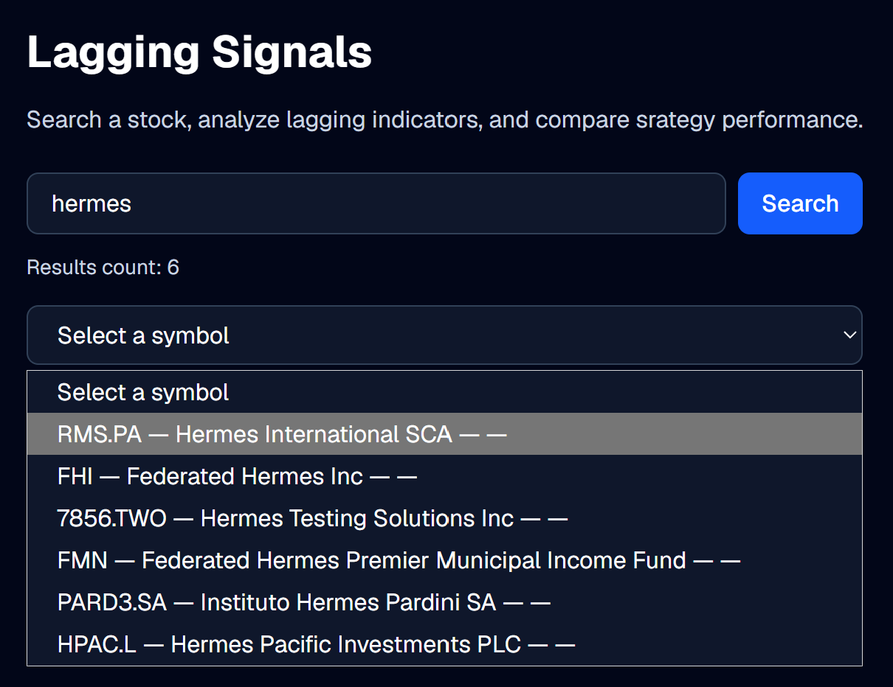
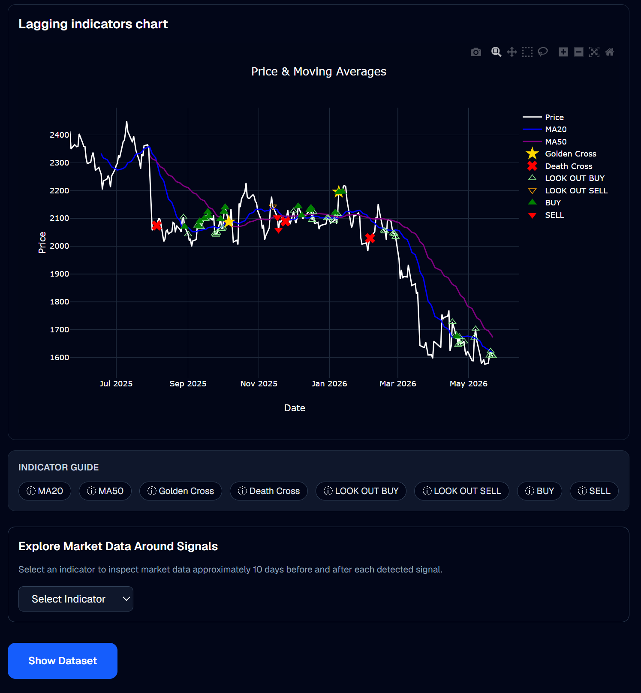
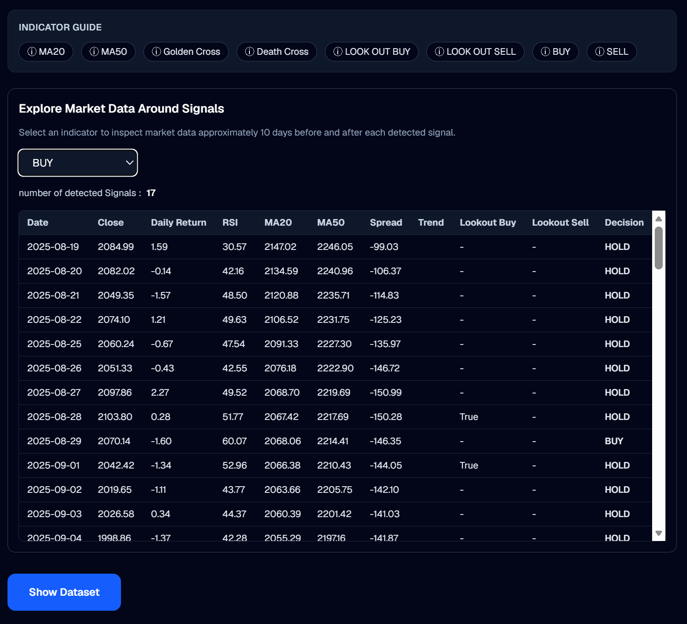

# Market Signal Lab

Market Signal Lab is a financial analytics application designed to explore stock market behaviour through technical indicators and trading signals.

The project aims to help users visualize market trends, detect technical signals, and understand the context surrounding market events.

🔗 Live application: https://market-signal-lab.vercel.app/

---

## Features

Current version includes:

✔ Stock search engine

✔ Interactive price visualization

✔ Technical indicators:

- MA20
- MA50
- RSI

✔ Signal detection:

- Golden Cross
- Death Cross
- BUY / SELL
- LOOK OUT BUY / SELL

✔ Signal exploration module:

Inspect market behaviour around detected events.

✔ Dataset exploration

---

## Example workflow

1. Search a stock

2. Select the market symbol

3. Visualize price evolution and indicators

4. Detect technical signals

5. Explore market context around signals

---

## Tech stack

Frontend:

- Next.js
- React
- Plotly
- TailwindCSS

Backend:

- FastAPI
- Pandas

Market data:

- Finnhub
- Alpha Vantage

Deployment:

- Vercel
- Render

---

## Future developments

Planned improvements:

- Leading indicators

- Predictive models

- Backtesting strategies

- Portfolio analytics

- AI-assisted signal generation

---

## Why this project?

I built this project to combine:

- Financial analysis
- Data science
- Decision-support systems
- Interactive visualization

The long-term objective is to evolve the application from lagging indicators toward predictive market analysis and leading signals.

---

## Project preview

---

---

## Author

VSC

Data Science • Financial Analytics • AI